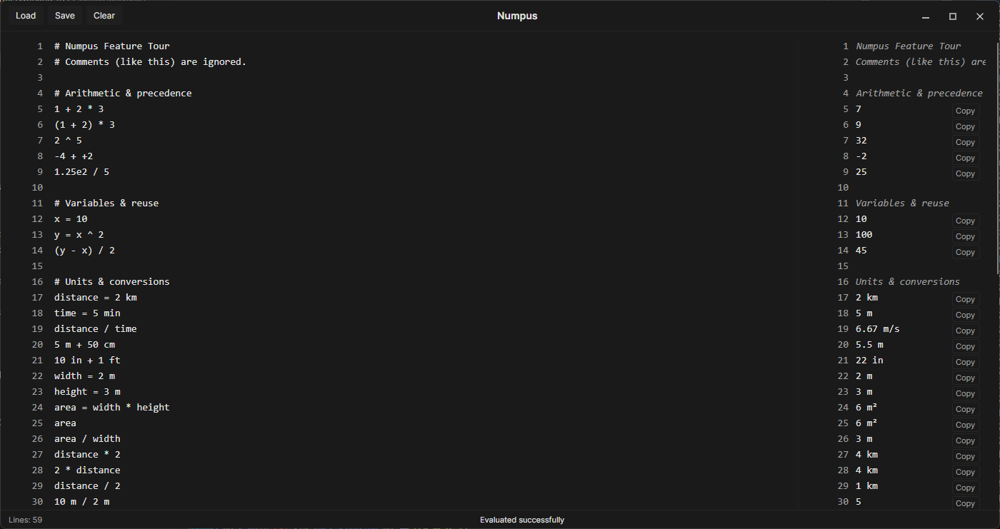

# Numpus

A cross-platform text-based calculator with variable and unit support built with Avalonia.

## Features

### Basic Arithmetic

- Standard operations: addition, subtraction, multiplication, division
- Exponentiation with `^` operator
- Operator precedence and parentheses
- Scientific notation support

### Variables

- Assign values to variables: `x = 10`
- Reuse variables in calculations: `y = x ^ 2`
- Case-insensitive variable names

### Unit Support

- Length units: m, cm, mm, km, in, ft
- Temperature units: c, f, k, degc, degf, degk
- Mass units: kg, g, lb
- Duration units: s, sec, ms, min, h, hr
- Automatic unit conversions: `5 m + 50 cm`
- Unit arithmetic: `distance / time`, `width * height`

### Functions

- Define custom functions: `square(n) = n ^ 2`
- Multiple parameters: `hypotenuse(a, b) = sqrt(a ^ 2 + b ^ 2)`
- Built-in functions: sqrt, max, min, round

### Comments

- Line comments with `#`
- Comments are ignored during evaluation

### Live Evaluation

- Real-time calculation as you type
- Line-by-line results
- Error highlighting

## Platform Support

Windows, macOS, Linux
